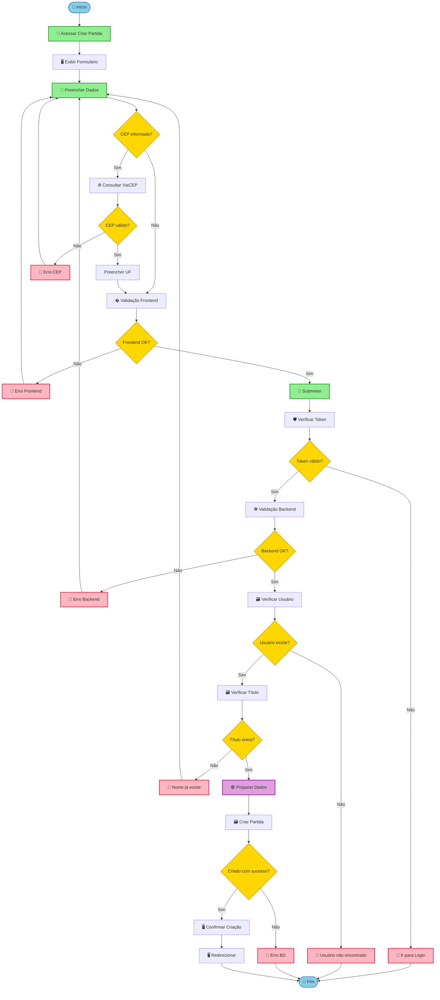

# Diagrama de Atividades - Criação de Partida Amistosa

Este diagrama mostra o fluxo de atividades completo para criação de partidas amistosas no sistema VarzeaLeague.

## 📋 **Legenda dos Elementos:**
- **🟢 Verde**: Ações do usuário
- **🔵 Azul**: Processos de validação
- **🟡 Amarelo**: Decisões/condições
- **🔴 Vermelho**: Erros e falhas
- **🟣 Roxo**: Processamento de dados
- **⚪ Branco**: Início/Fim do processo

## 🎯 **Principais Caminhos do Fluxo:**

### ✅ **Caminho de Sucesso:**
1. **Usuário acessa** → Preenche dados → Valida frontend
2. **Consulta CEP** (opcional) → Preenche UF automaticamente
3. **Autenticação** → Validações backend → Verifica usuário
4. **Título único** → Prepara dados → Cria partida
5. **Confirma criação** → Redireciona usuário

### ❌ **Caminhos de Erro:**
- **CEP inválido** → Retorna ao preenchimento
- **Validação frontend falha** → Exibe erros específicos
- **Token inválido** → Redireciona para login
- **Validação backend falha** → Exibe erros técnicos
- **Usuário não existe** → Erro de sistema
- **Título duplicado** → Sugere nome alternativo
- **Erro de banco** → Falha na criação

### 🔄 **Loops e Repetições:**
- **Correção de dados**: Usuário pode voltar ao preenchimento múltiplas vezes
- **Validação iterativa**: Frontend e backend validam independentemente
- **Recuperação de erros**: Sistema permite correção e nova tentativa

## 📊 **Pontos de Decisão Críticos:**

| Decisão | Critério | Ação Sucesso | Ação Falha |
|---------|----------|--------------|-------------|
| **CEP Válido** | Formato e existência | Auto-preenchimento | Retornar ao form |
| **Frontend OK** | Validações JS | Submeter dados | Exibir erros |
| **Token Válido** | JWT não expirado | Continuar fluxo | Login obrigatório |
| **Backend OK** | Regras de negócio | Verificar usuário | Corrigir dados |
| **Título Único** | Não existe no BD | Criar partida | Sugerir alternativo |

## 🚀 **Melhorias Implementadas:**

### 🎨 **Organização Visual:**
- **Cores específicas** para cada tipo de atividade
- **Emojis descritivos** para fácil identificação
- **Agrupamento lógico** de processos relacionados

### 🔍 **Detalhamento Técnico:**
- **Validações separadas** (frontend vs backend)
- **Integração externa** claramente identificada
- **Pontos de falha** mapeados com recuperação

### 📈 **Fluxo Otimizado:**
- **Validação em cascata** para detectar erros cedo
- **Feedback específico** para cada tipo de erro
- **Recuperação inteligente** com sugestões

Este diagrama oferece uma visão clara e completa do processo de criação de partidas, facilitando a compreensão tanto para desenvolvedores quanto para stakeholders do negócio! 🎯