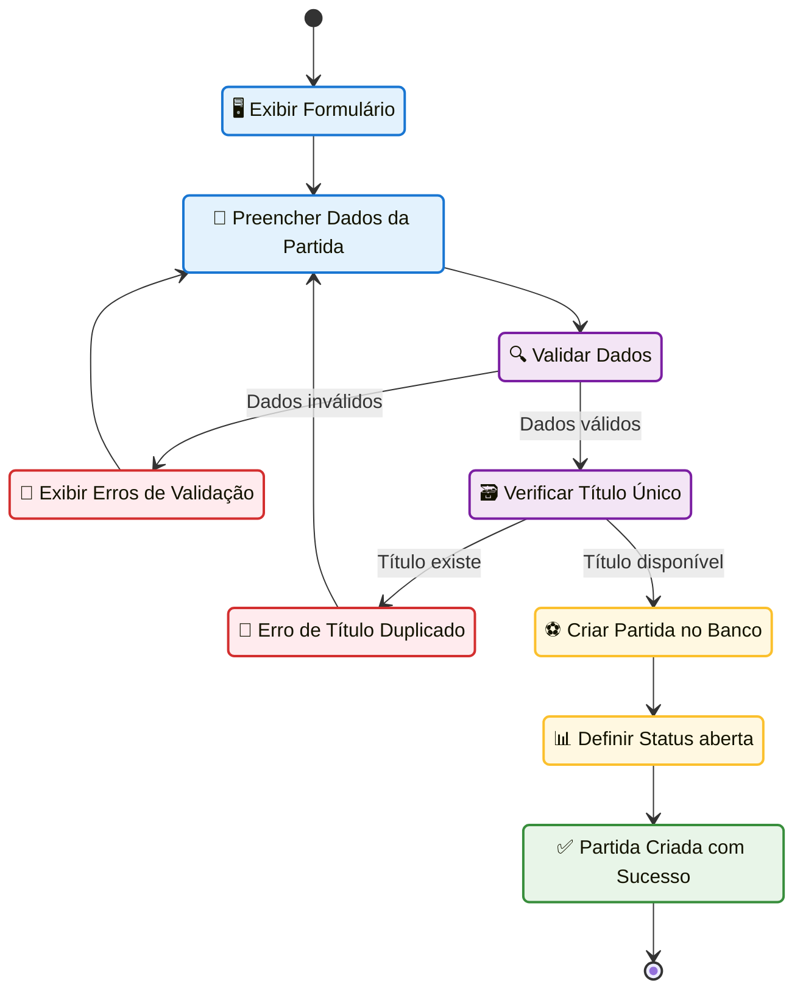
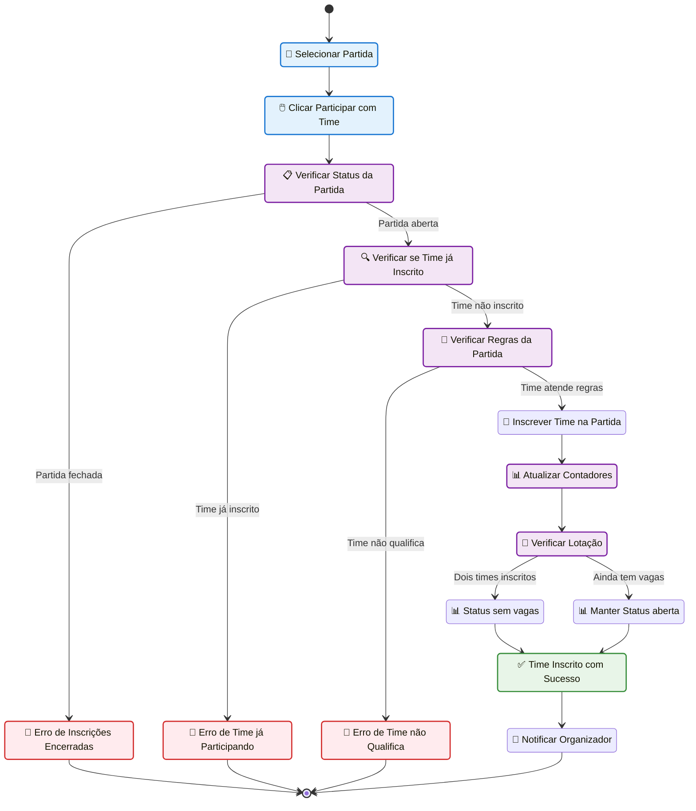
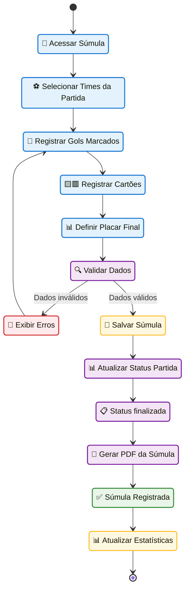
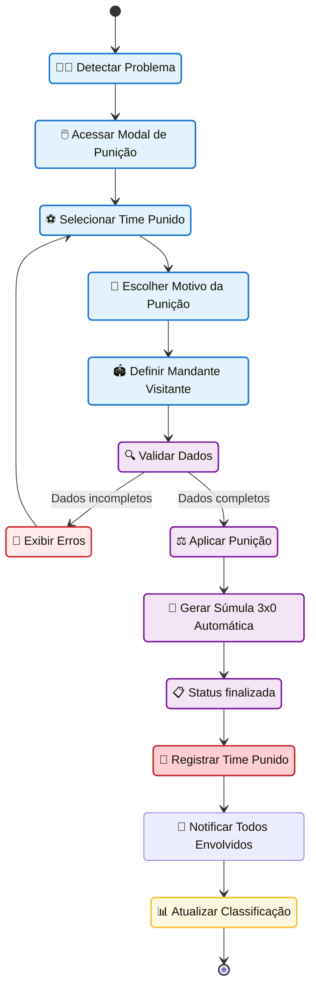
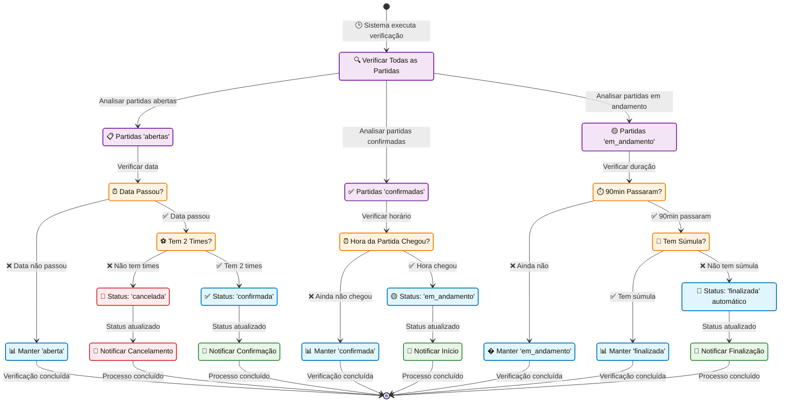
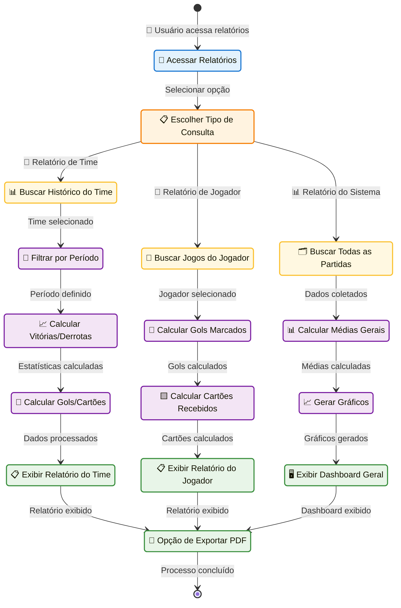
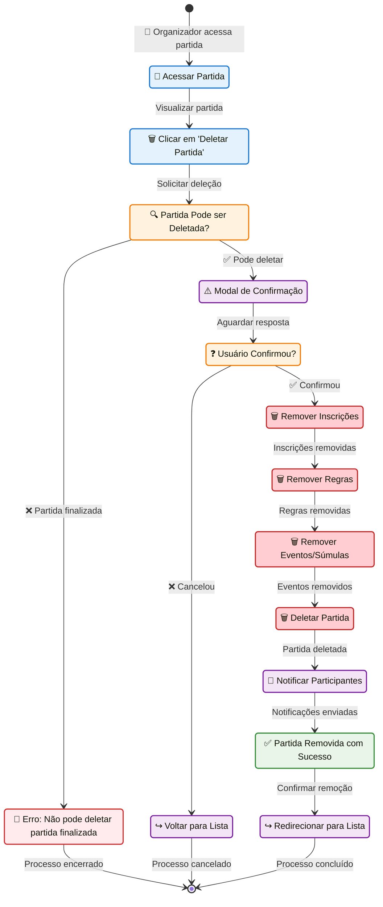

# Diagramas de Atividades UML - Gerenciamento de Partidas Amistosas VarzeaLeague

Este documento apresenta os diagramas de atividades seguindo o padrão UML para o sistema completo de gerenciamento de partidas amistosas do VarzeaLeague.

## 🎯 **1. Criar Partida Amistosa**

## ⚽ **2. Inscrever Time em Partida**

## 📝 **3. Registrar Súmula da Partida**

## ⚠️ **4. Aplicar Punição (WO)**

## 🔄 **5. Atualização Automática de Status**

## 📊 **6. Consultar Relatórios e Estatísticas**

## 🗑️ **7. Cancelar/Deletar Partida**

## 🎯 **Resumo dos Principais Fluxos:**

### **📋 Estados das Partidas:**
1. **'aberta'** → Aceita inscrições de times
2. **'sem_vagas'** → 2 times inscritos, não aceita mais
3. **'confirmada'** → Partida confirmada, aguardando início
4. **'em_andamento'** → Partida sendo jogada
5. **'finalizada'** → Partida encerrada com ou sem súmula
6. **'cancelada'** → Partida cancelada por falta de times

### **⚡ Transições Automáticas:**
- **Sistema verifica periodicamente** e atualiza status baseado em data/hora
- **Notificações automáticas** para todas as mudanças de status
- **Geração de relatórios** em tempo real
- **Sistema de punições** com súmulas automáticas

### **🔧 Funcionalidades Especiais:**
- **Validação de regras** por idade, gênero e quantidade de jogadores
- **Reutilização inteligente** de jogadores entre times
- **Upload de banners** para personalização visual
- **Geração de PDF** para súmulas e relatórios
- **Sistema de ranking** baseado em resultados

### **📐 Padrão UML Aplicado:**
- **Diagramas de Estado** utilizando sintaxe `stateDiagram-v2`
- **Estados bem definidos** com nomes descritivos
- **Transições claras** com condições explícitas
- **Estados inicial e final** marcados com `[*]`
- **Classificação visual** por cores para diferentes tipos de atividades
- **Conformidade UML** para representação de atividades

Estes diagramas representam fielmente todo o sistema de gerenciamento de partidas amistosas implementado no VarzeaLeague seguindo o padrão UML! 🚀