# Diagrama UML Completo do Backend VarzeaLeague

Este diagrama mostra todas as entidades do backend com os métodos dos controllers integrados nas classes correspondentes.

```mermaid
classDiagram
    %% CORE ENTITIES
    class User {
        -id: int
        -name: String
        -cpf: String
        -phone: String
        -email: String
        -password: String
        -gender: String
        -userTypeId: int
        -resetPasswordToken: String
        -resetPasswordExpires: Date
        -isDeleted: boolean
        -createdAt: Date
        -updatedAt: Date
        +login() String
        +logout() void
        +updateProfile() void
        +resetPassword() void
        +validateCredentials() boolean
        +index() Promise
        +store() Promise
        +update() Promise
        +remove() Promise
        +getById() Promise
        +requestPasswordReset() Promise
        +updatePassword() Promise
        +validatePhone() boolean
        +validateGender() boolean
        +validateCPF() boolean
    }

    class UserType {
        -id: int
        -name: String
        -description: String
        +getPermissions() Array
        +canManageTeams() boolean
        +canManageEvents() boolean
        +canManageChampionships() boolean
    }

    class Team {
        -id: int
        -name: String
        -description: String
        -banner: String
        -primaryColor: String
        -secondaryColor: String
        -foundationDate: Date
        -userId: int
        -isDeleted: boolean
        -createdAt: Date
        -updatedAt: Date
        +createTeam() Promise
        +listTeams() Promise
        +getTeam() Promise
        +updateTeam() Promise
        +deleteTeam() Promise
        +removePlayerFromTeam() Promise
        +getTeamCaptain() Promise
        +getTeamRanking() Promise
        +getPlayerStats() Promise
        +getTeamHistory() Promise
        +getStats() Object
        +uploadBanner() Promise
        +addPlayer() void
        +removePlayer() void
        +updateInfo() void
        +getAllFriendlyMatchesHistory() Promise
        +getAllChampionshipMatchesHistory() Promise
        +getMatchesByChampionshipHistory() Promise
    }

    class Player {
        -id: int
        -name: String
        -gender: String
        -dateOfBirth: Date
        -position: String
        -isDeleted: boolean
        -createdAt: Date
        -updatedAt: Date
        +create() Promise
        +addToTeam() Promise
        +getPlayersFromTeam() Promise
        +removeFromTeam() Promise
        +update() Promise
        +delete() Promise
        +getAge() int
        +getStats() Object
        +isAvailable() boolean
        +updatePosition() void
        +getPlayerStats() Promise
        +getRanking() Promise
    }

    class TeamPlayer {
        -id: int
        -teamId: int
        -playerId: int
        -joinDate: Date
        -isActive: boolean
        -createdAt: Date
        -updatedAt: Date
        +createTeamPlayer() Promise
        +getTeamsPlayers() Promise
        +deleteTeamPlayer() Promise
        +activate() void
        +deactivate() void
        +isCurrentlyActive() boolean
    }

    class TeamUser {
        -id: int
        -teamId: int
        -userId: int
        -createdAt: Date
        -updatedAt: Date
        +isActive() boolean
    }

    %% FRIENDLY MATCHES
    class FriendlyMatch {
        -id: int
        -title: String
        -date: Date
        -location: String
        -status: String
        -organizerId: int
        -price: decimal
        -duration: String
        -square: String
        -matchType: String
        -cep: String
        -uf: String
        -isDeleted: boolean
        -createdAt: Date
        -updatedAt: Date
        +createMatch() Promise
        +listMatches() Promise
        +getMatch() Promise
        +updateMatch() Promise
        +deleteMatch() Promise
        +cancelMatch() Promise
        +getMatchesByOrganizer() Promise
        +getFilteredMatches() Promise
        +checkAndCancelMatchesWithInsufficientTeams() Promise
        +finalizeMatch() Promise
        +addGoal() Promise
        +addCard() Promise
        +listEvents() Promise
        +deleteGoalEvent() Promise
        +deleteCardEvent() Promise
        +clearGoals() Promise
        +clearCards() Promise
        +confirmMatch() void
        +updateStatus() void
        +isRegistrationOpen() boolean
        +getParticipants() Array
        +updateAllMatchStatuses() Promise
        +checkAndSetMatchesInProgress() Promise
        +checkAndConfirmFullMatches() Promise
        +checkAndSetSemVagas() Promise
        +checkAndStartConfirmedMatches() Promise
    }

    class FriendlyMatchRules {
        -id: int
        -matchId: int
        -registrationDeadline: Date
        -registrationDeadlineTime: Time
        -minimumAge: int
        -maximumAge: int
        -gender: String
        +insertRules() Promise
        +deleteRules() Promise
        +updateRules() Promise
        +getAllRules() Promise
        +getRuleById() Promise
        +isRegistrationOpen() boolean
        +validatePlayer() boolean
        +updateDeadline() void
    }

    class FriendlyMatchReport {
        -id: int
        -matchId: int
        -homeTeamId: int
        -awayTeamId: int
        -homeTeamScore: int
        -awayTeamScore: int
        -status: String
        -observations: String
        -createdAt: Date
        -updatedAt: Date
        +addGoal() void
        +addCard() void
        +finalizeMatch() void
        +exportPDF() File
        +calculateResult() String
        +adicionarSumulaPartidasAmistosas() Promise
        +buscarSumulaPartidaAmistosa() Promise
        +deletarSumulaPartidaAmistosa() Promise
        +atualizarSumulaPartidaAmistosa() Promise
    }

    class MatchTeams {
        -id: int
        -matchId: int
        -teamId: int
        -status: String
        -joinedAt: Date
        -createdAt: Date
        -updatedAt: Date
        +joinMatchByTeam() Promise
        +getMatchTeams() Promise
        +deleteTeamMatch() Promise
        +getTeamsAvailable() Promise
        +checkTeamsRuleCompliance() Promise
        +verifyTeamsGenderRules() Promise
        +getTeamStatus() String
    }

    class Attendance {
        -id: int
        -matchId: int
        -playerId: int
        -teamId: int
        -status: String
        -confirmedAt: Date
        -createdAt: Date
        -updatedAt: Date
        +getMatchAttendance() Promise
        +updateAttendance() Promise
        +getTeamAttendanceStats() Promise
        +notifyPendingPlayers() Promise
        +confirm() void
        +decline() void
        +isConfirmed() boolean
    }

    class Goal {
        -id: int
        -matchId: int
        -userId: int
        -playerId: int
        -teamId: int
        -minute: int
        -createdAt: Date
        -updatedAt: Date
        +validate() boolean
        +save() void
    }

    class Card {
        -id: int
        -matchId: int
        -userId: int
        -playerId: int
        -teamId: int
        -cardType: String
        -minute: int
        -createdAt: Date
        -updatedAt: Date
        +isYellow() boolean
        +isRed() boolean
        +validate() boolean
        +save() void
    }

    class FriendlyMatchPenalty {
        -id: int
        -idMatch: int
        -idTeam: int
        -idPlayer: int
        -penaltyType: String
        -description: String
        -appliedAt: Date
        -isActive: boolean
        -createdAt: Date
        -updatedAt: Date
        +inserirPunicaoPartidaAmistosa() Promise
        +buscarPunicaoPartidaAmistosa() Promise
        +alterarPunicaoPartidaAmistosa() Promise
        +deletarPunicaoPartidaAmistosa() Promise
        +apply() void
        +revoke() void
        +isExpired() boolean
    }

    %% CHAMPIONSHIPS
    class Championship {
        -id: int
        -name: String
        -description: String
        -startDate: Date
        -endDate: Date
        -createdBy: int
        -modalidade: String
        -nomeQuadra: String
        -tipo: String
        -faseGrupos: boolean
        -maxTeams: int
        -genero: String
        -status: String
        -isDeleted: boolean
        -createdAt: Date
        -updatedAt: Date
        +createChampionship() Promise
        +listChampionships() Promise
        +getChampionship() Promise
        +updateChampionship() Promise
        +deleteChampionship() Promise
        +publishChampionship() Promise
        +joinTeamInChampionship() Promise
        +leaveTeamFromChampionship() Promise
        +getChampionshipTeams() Promise
        +applyToChampionship() Promise
        +getChampionshipApplications() Promise
        +updateApplicationStatus() Promise
        +createChampionshipMatch() Promise
        +getChampionshipMatches() Promise
        +uploadChampionshipLogo() Promise
        +openRegistration() void
        +closeRegistration() void
        +publish() void
        +generateMatches() void
        +getStandings() Array
        +isRegistrationOpen() boolean
    }

    class ChampionshipApplication {
        -id: int
        -championshipId: int
        -teamId: int
        -applicationDate: Date
        -status: String
        -rejectionReason: String
        -approvedBy: int
        -approvedAt: Date
        -createdAt: Date
        -updatedAt: Date
        +approve() void
        +reject() void
        +isPending() boolean
        +isApproved() boolean
    }

    class TeamChampionship {
        -id: int
        -teamId: int
        -championshipId: int
        -groupId: int
        -points: int
        -wins: int
        -draws: int
        -losses: int
        -goalsFor: int
        -goalsAgainst: int
        -goalDifference: int
        -isActive: boolean
        -joinedAt: Date
        -createdAt: Date
        -updatedAt: Date
        +updateStats() void
        +calculateGoalDifference() int
        +getPosition() int
    }

    class ChampionshipGroup {
        -id: int
        -championshipId: int
        -name: String
        -description: String
        -createdAt: Date
        -updatedAt: Date
        +addTeam() void
        +removeTeam() void
        +getTeams() Array
        +getStandings() Array
    }

    class MatchChampionship {
        -id: int
        -championshipId: int
        -date: Date
        -location: String
        -quadra: String
        -rodada: int
        -createdAt: Date
        -updatedAt: Date
        +addGoal() Promise
        +addCard() Promise
        +listEvents() Promise
        +deleteGoalEvent() Promise
        +deleteCardEvent() Promise
        +clearGoals() Promise
        +clearCards() Promise
        +schedule() void
        +reschedule() void
        +isCompleted() boolean
        +getResult() Object
    }

    class MatchReportChampionship {
        -id: int
        -matchId: int
        -homeTeamScore: int
        -awayTeamScore: int
        -status: String
        -observations: String
        -reportedBy: int
        -reportedAt: Date
        -createdAt: Date
        -updatedAt: Date
        +buscarSumulaPartidaCampeonato() Promise
        +atualizarSumulaPartidaCampeonato() Promise
        +deletarSumulaPartidaCampeonato() Promise
        +finalize() void
        +finalizeWO() void
        +updateScore() void
        +getWinner() Team
    }

    class ChampionshipMatchGoal {
        -id: int
        -matchId: int
        -userId: int
        -playerId: int
        -teamId: int
        -minute: int
        -createdAt: Date
        -updatedAt: Date
        +validate() boolean
        +save() void
    }

    class ChampionshipMatchCard {
        -id: int
        -matchId: int
        -userId: int
        -playerId: int
        -teamId: int
        -cardType: String
        -minute: int
        -createdAt: Date
        -updatedAt: Date
        +isYellow() boolean
        +isRed() boolean
        +validate() boolean
        +save() void
    }

    class ChampionshipPenalty {
        -id: int
        -championshipId: int
        -teamId: int
        -matchChampionshipId: int
        -reason: String
        -appliedAt: Date
        -isActive: boolean
        -createdAt: Date
        -updatedAt: Date
        +inserirPunicaoCampeonato() Promise
        +buscarPunicaoCampeonato() Promise
        +alterarPunicaoCampeonato() Promise
        +deletarPunicaoCampeonato() Promise
        +apply() void
        +revoke() void
        +isExpired() boolean
    }

    %% NOTIFICATIONS & ADMIN
    class Notification {
        -id: int
        -userId: int
        -type: String
        -title: String
        -message: String
        -isRead: boolean
        -relatedMatchId: int
        -relatedTeamId: int
        -relatedChampionshipId: int
        -createdAt: Date
        -updatedAt: Date
        +getUserNotifications() Promise
        +markNotificationAsRead() Promise
        +markAllNotificationsAsRead() Promise
        +getUnreadNotificationCount() Promise
        +createNotification() Promise
        +markAsRead() void
        +markAsUnread() void
        +send() void
    }

    class Overview {
        <<service>>
        +getOverview() Promise
        +searchOverviewEntities() Promise
    }

    class MatchRoster {
        <<service>>
        +getMatchRosterPlayers() Promise
    }

    class MatchPlayers {
        <<service>>
        +getMatchPlayersForAdmin() Promise
    }

    class FriendlyMatchEvaluation {
        -id: int
        -matchId: int
        -userId: int
        -evaluation: String
        -createdAt: Date
        -updatedAt: Date
        +listMatchEvaluations() Promise
        +upsertMatchEvaluation() Promise
        +getMatchEvaluationSummary() Promise
    }

    %% RELACIONAMENTOS SIMPLIFICADOS
    UserType "1" --> "*" User : has
    User "1" --> "*" Team : creates
    Team "*" --> "*" Player : contains
    TeamPlayer --> Team
    TeamPlayer --> Player
    User "1" --> "*" FriendlyMatch : organizes
    FriendlyMatch "1" --> "1" FriendlyMatchRules : has
    FriendlyMatch "1" --> "1" FriendlyMatchReport : generates
    FriendlyMatch "*" --> "*" Team : participates
    MatchTeams --> FriendlyMatch
    MatchTeams --> Team
    User "1" --> "*" Championship : creates
    Championship "1" --> "*" MatchChampionship : contains
    Team "*" --> "*" Championship : participates
    TeamChampionship --> Team
    TeamChampionship --> Championship
    User "1" --> "*" Notification : receives
```

## 🎯 **Principais Melhorias:**

### ✅ **Controllers Removidos - Métodos Integrados nas Classes:**

1. **User**: Todos os métodos de `UserController`, `AuthController`, `PasswordResetController`
2. **Team**: Métodos de `TeamController`, `TeamHistoryController` 
3. **Player**: Métodos de `PlayerController`, `PlayerRankingController`
4. **FriendlyMatch**: Métodos de `FriendlyMatchController`, `MatchController`, `FriendlyMatchEventsController`
5. **Championship**: Métodos de `ChampionshipController`, `ChampionshipMatchEventsController`
6. **MatchTeams**: Métodos de `MatchTeamsController`
7. **Notifications**: Métodos de `NotificationController`

### ✅ **Métodos Principais por Classe:**

- **User**: `login()`, `store()`, `update()`, `requestPasswordReset()`, validações
- **Team**: `createTeam()`, `getTeam()`, `updateTeam()`, `getPlayerStats()`, histórico
- **FriendlyMatch**: CRUD completo + eventos (gols, cartões) + status management
- **Championship**: Gestão completa + aplicações + publicação + matches
- **Penalties**: Punições para partidas amistosas e campeonatos

### 🗑️ **Classes de Service Separadas:**
- `Overview`, `MatchRoster`, `MatchPlayers` - Mantidas como services específicos

Agora o diagrama está **muito mais limpo** e representa a arquitetura real onde os métodos estão integrados nas classes de modelo! 🎯