# Diagrama UML Completo do Backend VarzeaLeague

Este diagrama mostra todas as entidades do backend incluindo as novas tabelas de junção e penalidades.

```mermaid
classDiagram
    class User {
        -id: int
        -name: String
        -cpf: String
        -phone: String
        -email: String
        -password: String
        -gender: String
        -userTypeId: int
        -resetPasswordToken: String
        -resetPasswordExpires: Date
        -isDeleted: boolean
        -createdAt: Date
        -updatedAt: Date
        +login() String
        +logout() void
        +updateProfile() void
        +resetPassword() void
        +validateCredentials() boolean
        +index() Promise
        +store() Promise
        +update() Promise
        +remove() Promise
        +getById() Promise
    }

    class UserType {
        -id: int
        -name: String
        -description: String
        +getPermissions() Array
        +canManageTeams() boolean
        +canManageEvents() boolean
        +canManageChampionships() boolean
    }

    class Team {
        -id: int
        -name: String
        -description: String
        -banner: String
        -primaryColor: String
        -secondaryColor: String
        -foundationDate: Date
        -userId: int
        -isDeleted: boolean
        -createdAt: Date
        -updatedAt: Date
        +addPlayer() void
        +removePlayer() void
        +updateInfo() void
        +uploadBanner() String
        +getStats() Object
        +getHistory() Array
        +create() Promise
        +index() Promise
        +show() Promise
        +update() Promise
        +delete() Promise
    }

    class Player {
        -id: int
        -name: String
        -gender: String
        -dateOfBirth: Date
        -position: String
        -isDeleted: boolean
        -createdAt: Date
        -updatedAt: Date
        +getAge() int
        +getStats() Object
        +isAvailable() boolean
        +updatePosition() void
        +create() Promise
        +addToTeam() Promise
        +getPlayersFromTeam() Promise
        +removeFromTeam() Promise
        +update() Promise
        +delete() Promise
        +getPlayerStats() Promise
    }

    class TeamPlayer {
        -id: int
        -teamId: int
        -playerId: int
        -joinDate: Date
        -isActive: boolean
        -createdAt: Date
        -updatedAt: Date
        +activate() void
        +deactivate() void
        +isCurrentlyActive() boolean
    }

    class TeamUser {
        -id: int
        -teamId: int
        -userId: int
        -createdAt: Date
        -updatedAt: Date
        +isActive() boolean
    }

    class MatchTeams {
        -id: int
        -matchId: int
        -teamId: int
        -status: String
        -joinedAt: Date
        -createdAt: Date
        -updatedAt: Date
        +getTeamStatus() String
    }

    class MatchChampionshipTeams {
        -id: int
        -matchChampionshipId: int
        -teamId: int
        -isHome: boolean
        -createdAt: Date
        -updatedAt: Date
        +setAsHome() void
        +setAsAway() void
        +isHomeTeam() boolean
    }

    class FriendlyMatchPenalty {
        -id: int
        -idMatch: int
        -idTeam: int
        -idPlayer: int
        -penaltyType: String
        -description: String
        -appliedAt: Date
        -isActive: boolean
        -createdAt: Date
        -updatedAt: Date
        +apply() void
        +revoke() void
        +isExpired() boolean
    }

    class ChampionshipPenalty {
        -id: int
        -championshipId: int
        -teamId: int
        -matchChampionshipId: int
        -reason: String
        -appliedAt: Date
        -isActive: boolean
        -createdAt: Date
        -updatedAt: Date
        +apply() void
        +revoke() void
        +isExpired() boolean
    }

    class ChampionshipGroup {
        -id: int
        -championshipId: int
        -name: String
        -description: String
        -createdAt: Date
        -updatedAt: Date
        +addTeam(teamId: int) void
        +removeTeam(teamId: int) void
        +getTeams() Array
        +getStandings() Array
    }

    class FriendlyMatch {
        -id: int
        -title: String
        -date: Date
        -location: String
        -status: String
        -organizerId: int
        -price: decimal
        -duration: String
        -square: String
        -matchType: String
        -cep: String
        -uf: String
        -isDeleted: boolean
        -createdAt: Date
        -updatedAt: Date
        +confirmMatch() void
        +cancelMatch() void
        +updateStatus() void
        +isRegistrationOpen() boolean
        +getParticipants() Array
        +createMatch() Promise
        +listMatches() Promise
        +getMatch() Promise
        +updateMatch() Promise
        +deleteMatch() Promise
        +addGoal() Promise
        +addCard() Promise
        +finalizeMatch() Promise
    }

    class FriendlyMatchRules {
        -id: int
        -matchId: int
        -registrationDeadline: Date
        -registrationDeadlineTime: Time
        -minimumAge: int
        -maximumAge: int
        -gender: String
        +isRegistrationOpen() boolean
        +validatePlayer() boolean
        +updateDeadline() void
    }

    class FriendlyMatchReport {
        -id: int
        -matchId: int
        -homeTeamId: int
        -awayTeamId: int
        -homeTeamScore: int
        -awayTeamScore: int
        -status: String
        -observations: String
        -createdAt: Date
        -updatedAt: Date
        +addGoal() void
        +addCard() void
        +finalizeMatch() void
        +exportPDF() File
        +calculateResult() String
    }

    class Goal {
        -id: int
        -matchId: int
        -userId: int
        -playerId: int
        -teamId: int
        -minute: int
        -createdAt: Date
        -updatedAt: Date
        +validate() boolean
        +save() void
    }

    class Card {
        -id: int
        -matchId: int
        -userId: int
        -playerId: int
        -teamId: int
        -cardType: String
        -minute: int
        -createdAt: Date
        -updatedAt: Date
        +isYellow() boolean
        +isRed() boolean
        +validate() boolean
        +save() void
    }

    class Attendance {
        -id: int
        -matchId: int
        -playerId: int
        -teamId: int
        -status: String
        -confirmedAt: Date
        -createdAt: Date
        -updatedAt: Date
        +confirm() void
        +decline() void
        +isConfirmed() boolean
    }

    class Championship {
        -id: int
        -name: String
        -description: String
        -startDate: Date
        -endDate: Date
        -createdBy: int
        -modalidade: String
        -nomeQuadra: String
        -tipo: String
        -faseGrupos: boolean
        -maxTeams: int
        -genero: String
        -status: String
        -isDeleted: boolean
        -createdAt: Date
        -updatedAt: Date
        +openRegistration() void
        +closeRegistration() void
        +publish() void
        +generateMatches() void
        +getStandings() Array
        +isRegistrationOpen() boolean
        +createChampionship() Promise
        +listChampionships() Promise
        +getChampionship() Promise
        +updateChampionship() Promise
        +deleteChampionship() Promise
        +publishChampionship() Promise
    }

    class ChampionshipApplication {
        -id: int
        -championshipId: int
        -teamId: int
        -applicationDate: Date
        -status: String
        -rejectionReason: String
        -approvedBy: int
        -approvedAt: Date
        -createdAt: Date
        -updatedAt: Date
        +approve() void
        +reject() void
        +isPending() boolean
        +isApproved() boolean
    }

    class TeamChampionship {
        -id: int
        -teamId: int
        -championshipId: int
        -groupId: int
        -points: int
        -wins: int
        -draws: int
        -losses: int
        -goalsFor: int
        -goalsAgainst: int
        -goalDifference: int
        -isActive: boolean
        -joinedAt: Date
        -createdAt: Date
        -updatedAt: Date
        +updateStats() void
        +calculateGoalDifference() int
        +getPosition() int
    }

    class MatchChampionship {
        -id: int
        -championshipId: int
        -date: Date
        -location: String
        -quadra: String
        -rodada: int
        -createdAt: Date
        -updatedAt: Date
        +schedule() void
        +reschedule() void
        +isCompleted() boolean
        +getResult() Object
    }

    class MatchReportChampionship {
        -id: int
        -matchId: int
        -homeTeamScore: int
        -awayTeamScore: int
        -status: String
        -observations: String
        -reportedBy: int
        -reportedAt: Date
        -createdAt: Date
        -updatedAt: Date
        +finalize() void
        +finalizeWO() void
        +updateScore() void
        +getWinner() Team
    }

    class ChampionshipMatchGoal {
        -id: int
        -matchId: int
        -userId: int
        -playerId: int
        -teamId: int
        -minute: int
        -createdAt: Date
        -updatedAt: Date
        +validate() boolean
        +save() void
    }

    class ChampionshipMatchCard {
        -id: int
        -matchId: int
        -userId: int
        -playerId: int
        -teamId: int
        -cardType: String
        -minute: int
        -createdAt: Date
        -updatedAt: Date
        +isYellow() boolean
        +isRed() boolean
        +validate() boolean
        +save() void
    }

    class Notification {
        -id: int
        -userId: int
        -type: String
        -title: String
        -message: String
        -isRead: boolean
        -relatedMatchId: int
        -relatedTeamId: int
        -relatedChampionshipId: int
        -createdAt: Date
        -updatedAt: Date
        +markAsRead() void
        +markAsUnread() void
        +send() void
    }

    UserType "1" --> "*" User
    User "1" --> "*" Team
    Team "*" --> "*" User
    TeamUser "*" --> "1" Team
    TeamUser "*" --> "1" User
    Team "1" --> "*" Player
    TeamPlayer "*" --> "1" Team
    TeamPlayer "*" --> "1" Player
    User "1" --> "*" FriendlyMatch
    FriendlyMatch "1" --> "1" FriendlyMatchRules
    FriendlyMatch "1" --> "1" FriendlyMatchReport
    FriendlyMatch "1" --> "*" Goal
    FriendlyMatch "1" --> "*" Card
    FriendlyMatch "1" --> "*" Attendance
    FriendlyMatch "1" --> "*" FriendlyMatchPenalty
    FriendlyMatch "*" --> "*" Team
    MatchTeams "*" --> "1" FriendlyMatch
    MatchTeams "*" --> "1" Team
    Goal "*" --> "1" User
    Goal "*" --> "1" Player
    Goal "*" --> "1" Team
    Card "*" --> "1" User
    Card "*" --> "1" Player
    Card "*" --> "1" Team
    Attendance "*" --> "1" Player
    Attendance "*" --> "1" Team
    FriendlyMatchPenalty "*" --> "1" Team
    FriendlyMatchPenalty "*" --> "1" Player
    FriendlyMatchReport "*" --> "1" Team
    User "1" --> "*" Championship
    Championship "1" --> "*" ChampionshipApplication
    Championship "1" --> "*" TeamChampionship
    Championship "1" --> "*" MatchChampionship
    Championship "1" --> "*" ChampionshipGroup
    Championship "1" --> "*" ChampionshipPenalty
    Team "1" --> "*" ChampionshipApplication
    ChampionshipApplication "*" --> "1" Championship
    ChampionshipApplication "*" --> "1" Team
    ChampionshipApplication "*" --> "1" User
    Team "1" --> "*" TeamChampionship
    TeamChampionship "*" --> "1" Championship
    TeamChampionship "*" --> "1" Team
    TeamChampionship "*" --> "1" ChampionshipGroup
    ChampionshipGroup "1" --> "*" TeamChampionship
    MatchChampionship "1" --> "1" MatchReportChampionship
    MatchChampionship "1" --> "*" ChampionshipMatchGoal
    MatchChampionship "1" --> "*" ChampionshipMatchCard
    MatchChampionship "*" --> "*" Team
    MatchChampionshipTeams "*" --> "1" MatchChampionship
    MatchChampionshipTeams "*" --> "1" Team
    ChampionshipMatchGoal "*" --> "1" User
    ChampionshipMatchGoal "*" --> "1" Player
    ChampionshipMatchGoal "*" --> "1" Team
    ChampionshipMatchCard "*" --> "1" User
    ChampionshipMatchCard "*" --> "1" Player
    ChampionshipMatchCard "*" --> "1" Team
    ChampionshipPenalty "*" --> "1" Team
    ChampionshipPenalty "*" --> "1" MatchChampionship
    MatchReportChampionship "*" --> "1" User
    User "1" --> "*" Notification
    Notification "*" --> "1" FriendlyMatch
    Notification "*" --> "1" Team
    Notification "*" --> "1" Championship
```

## Principais Melhorias do Diagrama

### ✨ **Entidades Adicionadas:**

1. **MatchTeams**: Tabela de junção para times em partidas amistosas
2. **MatchChampionshipTeams**: Tabela de junção para times em partidas de campeonato
3. **FriendlyMatchPenalty**: Sistema de penalidades para partidas amistosas
4. **ChampionshipPenalty**: Sistema de penalidades para campeonatos
5. **ChampionshipGroup**: Grupos dentro dos campeonatos
6. **FriendlyMatchReport**: Súmulas detalhadas de partidas amistosas
7. **MatchReportChampionship**: Súmulas detalhadas de partidas de campeonato
8. **Attendance**: Controle de presença em partidas

### 🔗 **Relacionamentos Principais:**

- **N:N entre Partidas e Times** via tabelas de junção específicas
- **Sistema de Penalidades** conectado a partidas e times
- **Grupos de Campeonato** com times organizados
- **Súmulas Detalhadas** para ambos tipos de partida
- **Controle de Presença** em partidas

### 📊 **Cardinalidades UML:**

- `||--o{` : Um para muitos (1:N)
- `}o--||` : Muitos para um (N:1) 
- `}o--o{` : Muitos para muitos (N:N)
- `||--o|` : Um para zero ou um (1:0..1)
- `}o--o|` : Muitos para zero ou um (N:0..1)
- `..>` : Dependência (Controllers)

Este diagrama representa a arquitetura completa e atualizada do sistema VarzeaLeague!