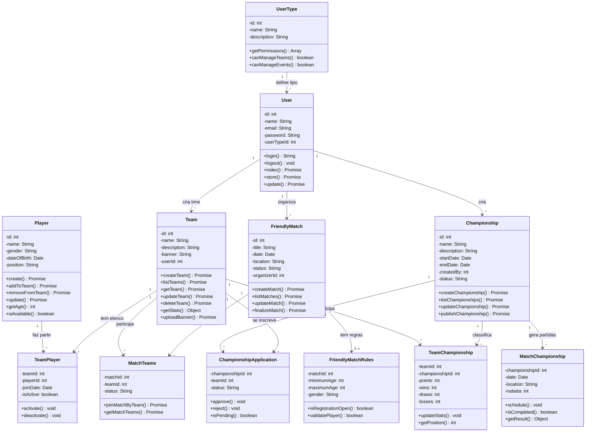

# Diagrama UML Básico - VarzeaLeague

Este diagrama mostra os principais models do sistema VarzeaLeague combinando partidas amistosas e campeonatos.

## 🎯 **VarzeaLeague - Principais Funcionalidades:**

### 👥 **Gestão de Usuários e Times:**
- **Usuários** com diferentes tipos de permissão
- **Times** com capitães e jogadores
- **Elencos** e vínculos de jogadores

### ⚽ **Partidas Amistosas:**
- **Criação** de partidas pelos usuários
- **Regras personalizáveis** (idade, gênero)
- **Participação** de múltiplos times
- **Gestão** completa do ciclo da partida

### 🏆 **Campeonatos:**
- **Criação** de torneios oficiais
- **Sistema de inscrições** com aprovação
- **Classificações** e pontuação
- **Partidas** organizadas por rodadas

### 📊 **Funcionalidades Transversais:**
- **Estatísticas** de times e jogadores
- **Histórico** de participações
- **Upload** de banners e logos
- **Sistema** de status e validações