# Diagrama UML - Sistema de Campeonatos

Este diagrama mostra as entidades e relacionamentos específicos do sistema de campeonatos.

```mermaid
classDiagram
    %% CORE ENTITIES
    class User {
        -id: int
        -name: String
        -cpf: String
        -phone: String
        -email: String
        -password: String
        -gender: String
        -userTypeId: int
        -resetPasswordToken: String
        -resetPasswordExpires: Date
        -isDeleted: boolean
        -createdAt: Date
        -updatedAt: Date
        +login() String
        +logout() void
        +updateProfile() void
        +resetPassword() void
        +validateCredentials() boolean
        +index() Promise
        +store() Promise
        +update() Promise
        +remove() Promise
        +getById() Promise
        +requestPasswordReset() Promise
        +updatePassword() Promise
        +validatePhone() boolean
        +validateGender() boolean
        +validateCPF() boolean
    }

    class UserType {
        -id: int
        -name: String
        -description: String
        +getPermissions() Array
        +canManageTeams() boolean
        +canManageEvents() boolean
        +canManageChampionships() boolean
    }

    class Team {
        -id: int
        -name: String
        -description: String
        -banner: String
        -primaryColor: String
        -secondaryColor: String
        -foundationDate: Date
        -userId: int
        -isDeleted: boolean
        -createdAt: Date
        -updatedAt: Date
        +createTeam() Promise
        +listTeams() Promise
        +getTeam() Promise
        +updateTeam() Promise
        +deleteTeam() Promise
        +removePlayerFromTeam() Promise
        +getTeamCaptain() Promise
        +getTeamRanking() Promise
        +getPlayerStats() Promise
        +getTeamHistory() Promise
        +getStats() Object
        +uploadBanner() Promise
        +addPlayer() void
        +removePlayer() void
        +updateInfo() void
        +getAllChampionshipMatchesHistory() Promise
        +getMatchesByChampionshipHistory() Promise
    }

    class Player {
        -id: int
        -name: String
        -gender: String
        -dateOfBirth: Date
        -position: String
        -isDeleted: boolean
        -createdAt: Date
        -updatedAt: Date
        +create() Promise
        +addToTeam() Promise
        +getPlayersFromTeam() Promise
        +removeFromTeam() Promise
        +update() Promise
        +delete() Promise
        +getAge() int
        +getStats() Object
        +isAvailable() boolean
        +updatePosition() void
        +getPlayerStats() Promise
        +getRanking() Promise
    }

    class TeamPlayer {
        -id: int
        -teamId: int
        -playerId: int
        -joinDate: Date
        -isActive: boolean
        -createdAt: Date
        -updatedAt: Date
        +createTeamPlayer() Promise
        +getTeamsPlayers() Promise
        +deleteTeamPlayer() Promise
        +activate() void
        +deactivate() void
        +isCurrentlyActive() boolean
    }

    class TeamUser {
        -id: int
        -teamId: int
        -userId: int
        -createdAt: Date
        -updatedAt: Date
        +isActive() boolean
    }

    %% CHAMPIONSHIPS ENTITIES
    class Championship {
        -id: int
        -name: String
        -description: String
        -startDate: Date
        -endDate: Date
        -createdBy: int
        -modalidade: String
        -nomeQuadra: String
        -tipo: String
        -faseGrupos: boolean
        -maxTeams: int
        -genero: String
        -status: String
        -isDeleted: boolean
        -createdAt: Date
        -updatedAt: Date
        +createChampionship() Promise
        +listChampionships() Promise
        +getChampionship() Promise
        +updateChampionship() Promise
        +deleteChampionship() Promise
        +publishChampionship() Promise
        +joinTeamInChampionship() Promise
        +leaveTeamFromChampionship() Promise
        +getChampionshipTeams() Promise
        +applyToChampionship() Promise
        +getChampionshipApplications() Promise
        +updateApplicationStatus() Promise
        +createChampionshipMatch() Promise
        +getChampionshipMatches() Promise
        +uploadChampionshipLogo() Promise
        +openRegistration() void
        +closeRegistration() void
        +publish() void
        +generateMatches() void
        +getStandings() Array
        +isRegistrationOpen() boolean
    }

    class ChampionshipApplication {
        -id: int
        -championshipId: int
        -teamId: int
        -applicationDate: Date
        -status: String
        -rejectionReason: String
        -approvedBy: int
        -approvedAt: Date
        -createdAt: Date
        -updatedAt: Date
        +approve() void
        +reject() void
        +isPending() boolean
        +isApproved() boolean
    }

    class TeamChampionship {
        -id: int
        -teamId: int
        -championshipId: int
        -groupId: int
        -points: int
        -wins: int
        -draws: int
        -losses: int
        -goalsFor: int
        -goalsAgainst: int
        -goalDifference: int
        -isActive: boolean
        -joinedAt: Date
        -createdAt: Date
        -updatedAt: Date
        +updateStats() void
        +calculateGoalDifference() int
        +getPosition() int
    }

    class ChampionshipGroup {
        -id: int
        -championshipId: int
        -name: String
        -description: String
        -createdAt: Date
        -updatedAt: Date
        +addTeam() void
        +removeTeam() void
        +getTeams() Array
        +getStandings() Array
    }

    class MatchChampionship {
        -id: int
        -championshipId: int
        -date: Date
        -location: String
        -quadra: String
        -rodada: int
        -createdAt: Date
        -updatedAt: Date
        +addGoal() Promise
        +addCard() Promise
        +listEvents() Promise
        +deleteGoalEvent() Promise
        +deleteCardEvent() Promise
        +clearGoals() Promise
        +clearCards() Promise
        +schedule() void
        +reschedule() void
        +isCompleted() boolean
        +getResult() Object
    }

    class MatchChampionshipTeams {
        -id: int
        -matchChampionshipId: int
        -teamId: int
        -isHome: boolean
        -createdAt: Date
        -updatedAt: Date
        +setAsHome() void
        +setAsAway() void
        +isHomeTeam() boolean
    }

    class MatchReportChampionship {
        -id: int
        -matchId: int
        -homeTeamScore: int
        -awayTeamScore: int
        -status: String
        -observations: String
        -reportedBy: int
        -reportedAt: Date
        -createdAt: Date
        -updatedAt: Date
        +buscarSumulaPartidaCampeonato() Promise
        +atualizarSumulaPartidaCampeonato() Promise
        +deletarSumulaPartidaCampeonato() Promise
        +finalize() void
        +finalizeWO() void
        +updateScore() void
        +getWinner() Team
    }

    class ChampionshipMatchGoal {
        -id: int
        -matchId: int
        -userId: int
        -playerId: int
        -teamId: int
        -minute: int
        -createdAt: Date
        -updatedAt: Date
        +validate() boolean
        +save() void
    }

    class ChampionshipMatchCard {
        -id: int
        -matchId: int
        -userId: int
        -playerId: int
        -teamId: int
        -cardType: String
        -minute: int
        -createdAt: Date
        -updatedAt: Date
        +isYellow() boolean
        +isRed() boolean
        +validate() boolean
        +save() void
    }

    class ChampionshipPenalty {
        -id: int
        -championshipId: int
        -teamId: int
        -matchChampionshipId: int
        -reason: String
        -appliedAt: Date
        -isActive: boolean
        -createdAt: Date
        -updatedAt: Date
        +inserirPunicaoCampeonato() Promise
        +buscarPunicaoCampeonato() Promise
        +alterarPunicaoCampeonato() Promise
        +deletarPunicaoCampeonato() Promise
        +apply() void
        +revoke() void
        +isExpired() boolean
    }

    %% RELACIONAMENTOS - CAMPEONATOS
    UserType "1" --> "*" User : tem
    User "1" --> "*" Team : cria/capitão
    Team "*" --> "*" User : tem membros
    TeamUser "*" --> "1" Team : pertence
    TeamUser "*" --> "1" User : vincula
    
    Team "1" --> "*" Player : contrata
    TeamPlayer "*" --> "1" Team : vincula
    TeamPlayer "*" --> "1" Player : associa
    
    User "1" --> "*" Championship : cria
    Championship "1" --> "*" ChampionshipApplication : recebe inscrições
    Championship "1" --> "*" TeamChampionship : tem participantes
    Championship "1" --> "*" ChampionshipGroup : organiza grupos
    Championship "1" --> "*" MatchChampionship : gera partidas
    Championship "1" --> "*" ChampionshipPenalty : aplica penalidades
    
    Team "1" --> "*" ChampionshipApplication : se inscreve
    ChampionshipApplication "*" --> "1" Championship : para campeonato
    ChampionshipApplication "*" --> "1" Team : do time
    ChampionshipApplication "*" --> "0..1" User : aprovada por
    
    Team "1" --> "*" TeamChampionship : participa
    TeamChampionship "*" --> "1" Championship : em campeonato
    TeamChampionship "*" --> "1" Team : do time
    TeamChampionship "*" --> "0..1" ChampionshipGroup : no grupo
    
    ChampionshipGroup "1" --> "*" TeamChampionship : contém times
    
    MatchChampionship "1" --> "0..1" MatchReportChampionship : gera súmula
    MatchChampionship "1" --> "*" ChampionshipMatchGoal : registra gols
    MatchChampionship "1" --> "*" ChampionshipMatchCard : registra cartões
    MatchChampionship "*" --> "*" Team : entre times
    
    MatchChampionshipTeams "*" --> "1" MatchChampionship : vincula partida
    MatchChampionshipTeams "*" --> "1" Team : vincula time
    
    ChampionshipMatchGoal "*" --> "0..1" User : feito por usuário
    ChampionshipMatchGoal "*" --> "0..1" Player : feito por jogador
    ChampionshipMatchGoal "*" --> "1" Team : para o time
    
    ChampionshipMatchCard "*" --> "0..1" User : aplicado a usuário
    ChampionshipMatchCard "*" --> "0..1" Player : aplicado a jogador
    ChampionshipMatchCard "*" --> "1" Team : do time
    
    ChampionshipPenalty "*" --> "1" Team : aplicada ao time
    ChampionshipPenalty "*" --> "0..1" MatchChampionship : na partida
    
    MatchReportChampionship "*" --> "0..1" User : reportada por
```

## 🏆 **Sistema de Campeonatos - Principais Funcionalidades:**

### 📋 **Gestão de Campeonatos:**
- **Criação e configuração** de campeonatos
- **Sistema de inscrições** com aprovação/rejeição
- **Organização em grupos** (fase de grupos)
- **Geração automática** de partidas
- **Publicação** e gestão de status

### ⚽ **Partidas de Campeonato:**
- **Calendário** de jogos por rodadas
- **Escalações** e times mandante/visitante
- **Eventos** (gols, cartões) específicos do campeonato
- **Súmulas oficiais** com resultados
- **Sistema de WO** (Walk Over)

### 📊 **Classificação e Estatísticas:**
- **Tabela de classificação** por grupo
- **Pontuação** (vitórias, empates, derrotas)
- **Saldo de gols** e estatísticas
- **Histórico** de participações
- **Rankings** e premiações

### ⚖️ **Gestão Disciplinar:**
- **Sistema de penalidades** específico
- **Controle disciplinar** por campeonato
- **Punições** para times e jogadores
- **Relatórios** de infrações