# Diagrama UML - Sistema de Partidas Amistosas

Este diagrama mostra as entidades e relacionamentos específicos do sistema de partidas amistosas.

```mermaid
classDiagram
    %% CORE ENTITIES
    class User {
        -id: int
        -name: String
        -cpf: String
        -phone: String
        -email: String
        -password: String
        -gender: String
        -userTypeId: int
        -resetPasswordToken: String
        -resetPasswordExpires: Date
        -isDeleted: boolean
        -createdAt: Date
        -updatedAt: Date
        +login() String
        +logout() void
        +updateProfile() void
        +resetPassword() void
        +validateCredentials() boolean
        +index() Promise
        +store() Promise
        +update() Promise
        +remove() Promise
        +getById() Promise
        +requestPasswordReset() Promise
        +updatePassword() Promise
        +validatePhone() boolean
        +validateGender() boolean
        +validateCPF() boolean
    }

    class UserType {
        -id: int
        -name: String
        -description: String
        +getPermissions() Array
        +canManageTeams() boolean
        +canManageEvents() boolean
        +canManageChampionships() boolean
    }

    class Team {
        -id: int
        -name: String
        -description: String
        -banner: String
        -primaryColor: String
        -secondaryColor: String
        -foundationDate: Date
        -userId: int
        -isDeleted: boolean
        -createdAt: Date
        -updatedAt: Date
        +createTeam() Promise
        +listTeams() Promise
        +getTeam() Promise
        +updateTeam() Promise
        +deleteTeam() Promise
        +removePlayerFromTeam() Promise
        +getTeamCaptain() Promise
        +getTeamRanking() Promise
        +getPlayerStats() Promise
        +getTeamHistory() Promise
        +getStats() Object
        +uploadBanner() Promise
        +addPlayer() void
        +removePlayer() void
        +updateInfo() void
        +getAllFriendlyMatchesHistory() Promise
    }

    class Player {
        -id: int
        -name: String
        -gender: String
        -dateOfBirth: Date
        -position: String
        -isDeleted: boolean
        -createdAt: Date
        -updatedAt: Date
        +create() Promise
        +addToTeam() Promise
        +getPlayersFromTeam() Promise
        +removeFromTeam() Promise
        +update() Promise
        +delete() Promise
        +getAge() int
        +getStats() Object
        +isAvailable() boolean
        +updatePosition() void
        +getPlayerStats() Promise
        +getRanking() Promise
    }

    class TeamPlayer {
        -id: int
        -teamId: int
        -playerId: int
        -joinDate: Date
        -isActive: boolean
        -createdAt: Date
        -updatedAt: Date
        +createTeamPlayer() Promise
        +getTeamsPlayers() Promise
        +deleteTeamPlayer() Promise
        +activate() void
        +deactivate() void
        +isCurrentlyActive() boolean
    }

    class TeamUser {
        -id: int
        -teamId: int
        -userId: int
        -createdAt: Date
        -updatedAt: Date
        +isActive() boolean
    }

    %% FRIENDLY MATCHES ENTITIES
    class FriendlyMatch {
        -id: int
        -title: String
        -date: Date
        -location: String
        -status: String
        -organizerId: int
        -price: decimal
        -duration: String
        -square: String
        -matchType: String
        -cep: String
        -uf: String
        -isDeleted: boolean
        -createdAt: Date
        -updatedAt: Date
        +createMatch() Promise
        +listMatches() Promise
        +getMatch() Promise
        +updateMatch() Promise
        +deleteMatch() Promise
        +cancelMatch() Promise
        +getMatchesByOrganizer() Promise
        +getFilteredMatches() Promise
        +checkAndCancelMatchesWithInsufficientTeams() Promise
        +finalizeMatch() Promise
        +addGoal() Promise
        +addCard() Promise
        +listEvents() Promise
        +deleteGoalEvent() Promise
        +deleteCardEvent() Promise
        +clearGoals() Promise
        +clearCards() Promise
        +confirmMatch() void
        +updateStatus() void
        +isRegistrationOpen() boolean
        +getParticipants() Array
        +updateAllMatchStatuses() Promise
        +checkAndSetMatchesInProgress() Promise
        +checkAndConfirmFullMatches() Promise
        +checkAndSetSemVagas() Promise
        +checkAndStartConfirmedMatches() Promise
    }

    class FriendlyMatchRules {
        -id: int
        -matchId: int
        -registrationDeadline: Date
        -registrationDeadlineTime: Time
        -minimumAge: int
        -maximumAge: int
        -gender: String
        +insertRules() Promise
        +deleteRules() Promise
        +updateRules() Promise
        +getAllRules() Promise
        +getRuleById() Promise
        +isRegistrationOpen() boolean
        +validatePlayer() boolean
        +updateDeadline() void
    }

    class FriendlyMatchReport {
        -id: int
        -matchId: int
        -homeTeamId: int
        -awayTeamId: int
        -homeTeamScore: int
        -awayTeamScore: int
        -status: String
        -observations: String
        -createdAt: Date
        -updatedAt: Date
        +addGoal() void
        +addCard() void
        +finalizeMatch() void
        +exportPDF() File
        +calculateResult() String
        +adicionarSumulaPartidasAmistosas() Promise
        +buscarSumulaPartidaAmistosa() Promise
        +deletarSumulaPartidaAmistosa() Promise
        +atualizarSumulaPartidaAmistosa() Promise
    }

    class MatchTeams {
        -id: int
        -matchId: int
        -teamId: int
        -status: String
        -joinedAt: Date
        -createdAt: Date
        -updatedAt: Date
        +joinMatchByTeam() Promise
        +getMatchTeams() Promise
        +deleteTeamMatch() Promise
        +getTeamsAvailable() Promise
        +checkTeamsRuleCompliance() Promise
        +verifyTeamsGenderRules() Promise
        +getTeamStatus() String
    }

    class Attendance {
        -id: int
        -matchId: int
        -playerId: int
        -teamId: int
        -status: String
        -confirmedAt: Date
        -createdAt: Date
        -updatedAt: Date
        +getMatchAttendance() Promise
        +updateAttendance() Promise
        +getTeamAttendanceStats() Promise
        +notifyPendingPlayers() Promise
        +confirm() void
        +decline() void
        +isConfirmed() boolean
    }

    class Goal {
        -id: int
        -matchId: int
        -userId: int
        -playerId: int
        -teamId: int
        -minute: int
        -createdAt: Date
        -updatedAt: Date
        +validate() boolean
        +save() void
    }

    class Card {
        -id: int
        -matchId: int
        -userId: int
        -playerId: int
        -teamId: int
        -cardType: String
        -minute: int
        -createdAt: Date
        -updatedAt: Date
        +isYellow() boolean
        +isRed() boolean
        +validate() boolean
        +save() void
    }

    class FriendlyMatchPenalty {
        -id: int
        -idMatch: int
        -idTeam: int
        -idPlayer: int
        -penaltyType: String
        -description: String
        -appliedAt: Date
        -isActive: boolean
        -createdAt: Date
        -updatedAt: Date
        +inserirPunicaoPartidaAmistosa() Promise
        +buscarPunicaoPartidaAmistosa() Promise
        +alterarPunicaoPartidaAmistosa() Promise
        +deletarPunicaoPartidaAmistosa() Promise
        +apply() void
        +revoke() void
        +isExpired() boolean
    }

    class FriendlyMatchEvaluation {
        -id: int
        -matchId: int
        -userId: int
        -evaluation: String
        -createdAt: Date
        -updatedAt: Date
        +listMatchEvaluations() Promise
        +upsertMatchEvaluation() Promise
        +getMatchEvaluationSummary() Promise
    }

    %% RELACIONAMENTOS - PARTIDAS AMISTOSAS
    UserType "1" --> "*" User : tem
    User "1" --> "*" Team : cria/capitão
    Team "*" --> "*" User : tem membros
    TeamUser "*" --> "1" Team : pertence
    TeamUser "*" --> "1" User : vincula
    
    Team "1" --> "*" Player : contrata
    TeamPlayer "*" --> "1" Team : vincula
    TeamPlayer "*" --> "1" Player : associa
    
    User "1" --> "*" FriendlyMatch : organiza
    FriendlyMatch "1" --> "0..1" FriendlyMatchRules : possui regras
    FriendlyMatch "1" --> "0..1" FriendlyMatchReport : gera súmula
    
    FriendlyMatch "*" --> "*" Team : participam
    MatchTeams "*" --> "1" FriendlyMatch : vincula partida
    MatchTeams "*" --> "1" Team : vincula time
    
    FriendlyMatch "1" --> "*" Goal : registra gols
    FriendlyMatch "1" --> "*" Card : registra cartões
    FriendlyMatch "1" --> "*" Attendance : controla presença
    FriendlyMatch "1" --> "*" FriendlyMatchPenalty : aplica penalidades
    FriendlyMatch "1" --> "*" FriendlyMatchEvaluation : recebe avaliações
    
    Goal "*" --> "0..1" User : feito por usuário
    Goal "*" --> "0..1" Player : feito por jogador
    Goal "*" --> "1" Team : para o time
    
    Card "*" --> "0..1" User : aplicado a usuário
    Card "*" --> "0..1" Player : aplicado a jogador
    Card "*" --> "1" Team : do time
    
    Attendance "*" --> "1" Player : do jogador
    Attendance "*" --> "1" Team : do time
    
    FriendlyMatchPenalty "*" --> "1" Team : aplicada ao time
    FriendlyMatchPenalty "*" --> "0..1" Player : aplicada ao jogador
    
    FriendlyMatchEvaluation "*" --> "1" User : avaliada por
```

## 🎯 **Sistema de Partidas Amistosas - Principais Funcionalidades:**

### ⚽ **Gestão de Partidas:**
- **Criação e configuração** de partidas amistosas
- **Regras personalizáveis** (idade, gênero, deadline)
- **Sistema de status** (aberta, confirmada, em andamento, finalizada)
- **Gestão de participantes** e times

### 📊 **Eventos e Estatísticas:**
- **Gols e cartões** durante as partidas
- **Controle de presença** de jogadores
- **Súmulas detalhadas** com resultados
- **Avaliações** pós-partida
- **Sistema de penalidades**

### 👥 **Gestão de Times e Jogadores:**
- **Times e elencos** completos
- **Vínculos** entre jogadores e times
- **Histórico** de participações
- **Estatísticas** individuais e coletivas