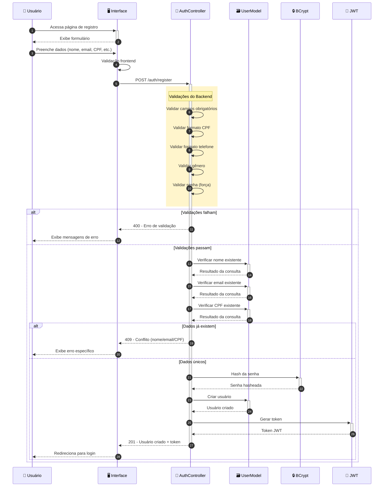
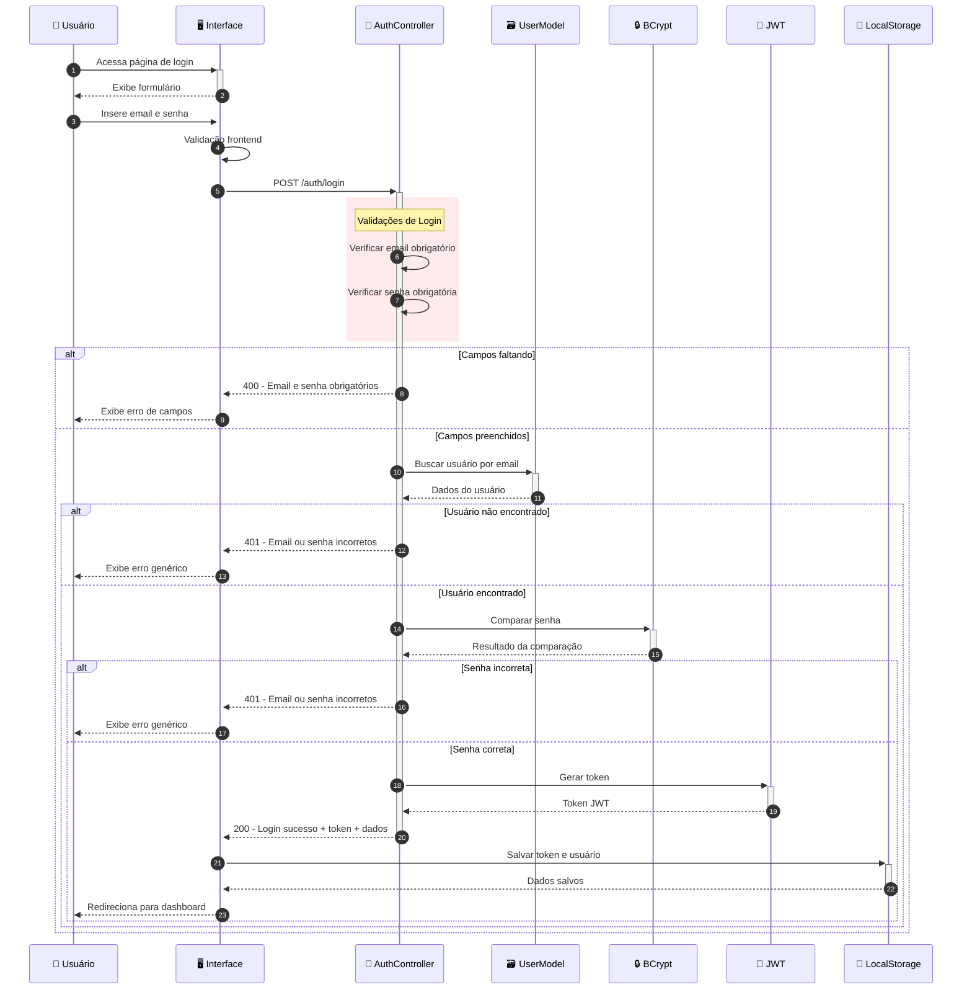
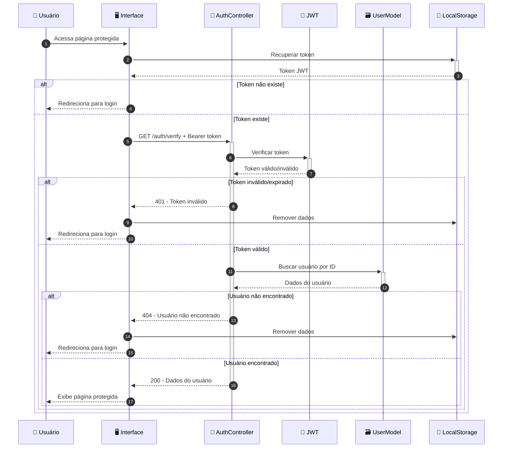

# Diagrama de Sequência - Registro e Login de Usuário

Este diagrama mostra o fluxo completo de registro e autenticação de usuários no sistema VarzeaLeague.

## 🔐 Fluxo de Registro de Usuário

## 🔑 Fluxo de Login de Usuário

## 🛡️ Fluxo de Verificação de Token

## 🎯 **Principais Funcionalidades do Sistema de Auth:**

### 🔒 **Segurança:**
- **Validação rigorosa** de CPF, telefone e senha
- **Hash bcrypt** para senhas
- **Tokens JWT** com expiração de 24h
- **Mensagens genéricas** para login (não revela se email existe)

### ✅ **Validações:**
- **Nome único** no sistema
- **Email único** no sistema  
- **CPF único** e válido matematicamente
- **Senha forte** (maiúscula, minúscula, número, especial)
- **Telefone** no formato brasileiro

### 🎮 **Experiência do Usuário:**
- **Feedback específico** em validações de registro
- **Redirecionamento automático** após login
- **Persistência de sessão** via LocalStorage
- **Proteção de rotas** com verificação de token