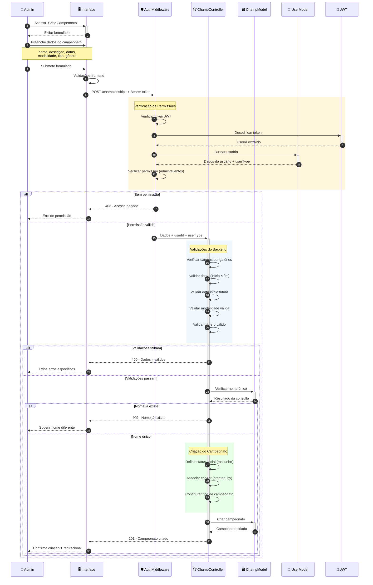
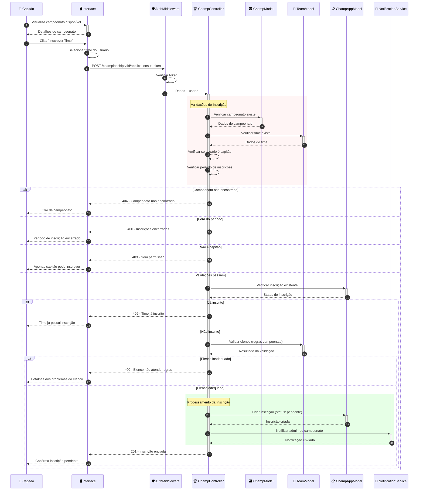
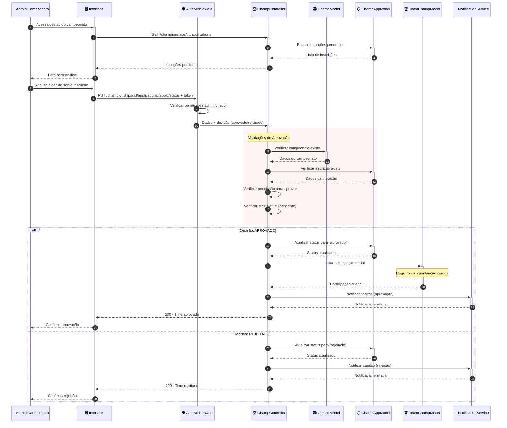
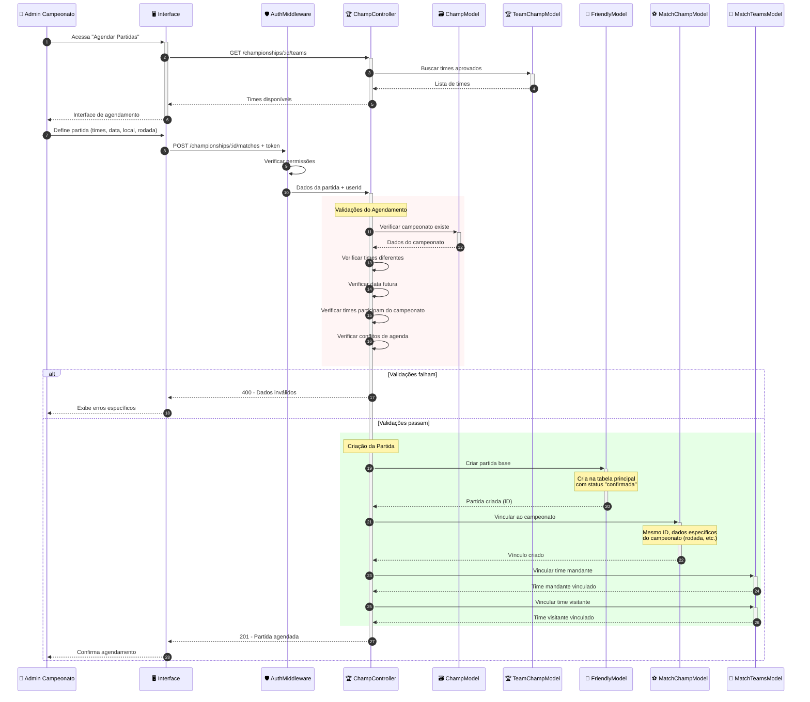

# Diagrama de Sequência - Sistema de Campeonatos

Este diagrama mostra o fluxo completo de criação e gestão de campeonatos no sistema VarzeaLeague.

## 🏆 Fluxo de Criação de Campeonato

## 📝 Fluxo de Inscrição de Time em Campeonato

## ✅ Fluxo de Aprovação de Inscrições

## ⚽ Fluxo de Agendamento de Partidas

## 🏅 **Principais Funcionalidades do Sistema de Campeonatos:**

### 🏆 **Criação e Gestão:**
- **Controle de permissões** (apenas admins podem criar)
- **Validações rigorosas** de datas e configurações
- **Sistema de status** (rascunho → publicado → iniciado)
- **Configuração flexível** de modalidades e gêneros

### 📝 **Sistema de Inscrições:**
- **Processo de aprovação** controlado pelo admin
- **Validação automática** do elenco contra regras
- **Notificações automáticas** para todas as partes
- **Controle de períodos** de inscrição

### ⚽ **Agendamento de Partidas:**
- **Integração com sistema** de partidas principal
- **Controle de rodadas** e classificação
- **Verificação de conflitos** de agenda
- **Gestão automática** de status das partidas

### 🎯 **Funcionalidades Avançadas:**
- **Sistema dual** (FriendlyMatches + MatchChampionship)
- **Classificação automática** com pontuação
- **Gestão de elencos** e validações de regras
- **Notificações** em tempo real para participantes