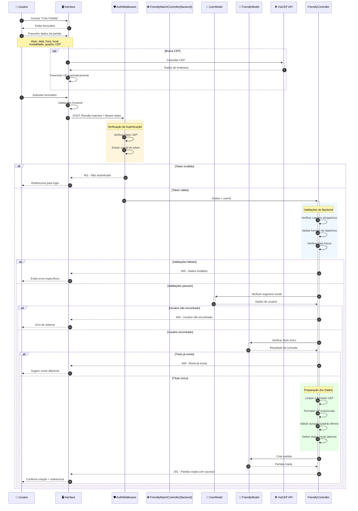
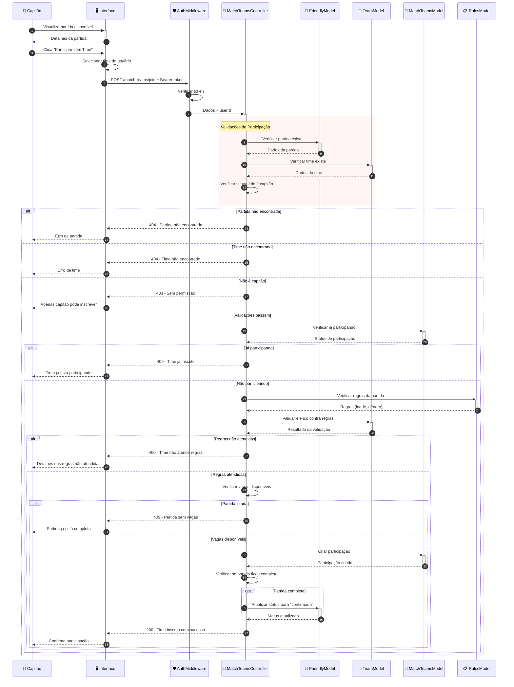
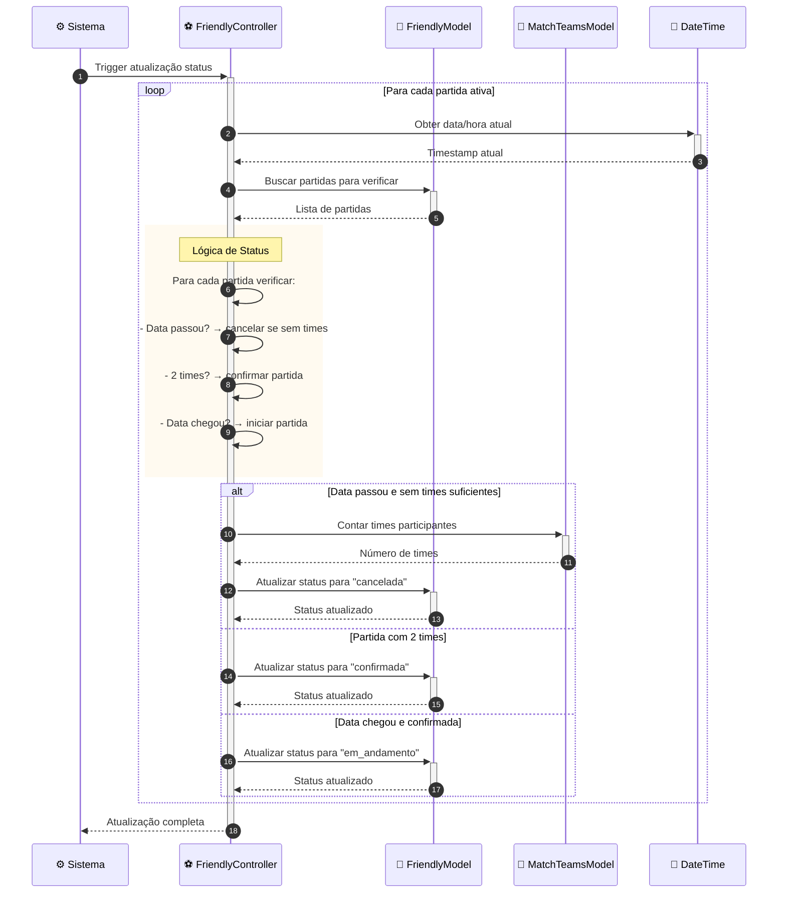

# Diagrama de Sequência - Criação de Partida Amistosa

Este diagrama mostra o fluxo completo de criação de partidas amistosas no sistema VarzeaLeague.

## ⚽ Fluxo de Criação de Partida Amistosa

### 📋 **Legenda dos Participantes:**
| Participante | Descrição | Responsabilidade |
|-------------|-----------|------------------|
| 👤 **Usuário** | Usuário final logado no sistema | Criador da partida amistosa |
| 🖥️ **Interface** | Frontend da aplicação | Validações iniciais e exibição |
| 🛡️ **AuthMiddleware** | Middleware de autenticação | Verificação de token JWT |
| ⚽ **FriendlyMatchController** | Controller do backend | Lógica de negócio e validações |
| 👥 **UserModel** | Modelo de usuários | Persistência de dados de usuários |
| 🏃 **FriendlyModel** | Modelo de partidas amistosas | Persistência das partidas |
| 🌐 **ViaCEP API** | Serviço externo de CEP | Validação e dados de endereço |

### 🎨 **Códigos de Cores:**
- 🟡 **Amarelo claro** `rgb(255, 245, 220)` - Processos de autenticação
- 🔵 **Azul claro** `rgb(240, 248, 255)` - Validações de backend
- 🟢 **Verde claro** `rgb(230, 255, 230)` - Preparação e processamento de dados

## 🏆 Fluxo de Participação de Time em Partida

## 🎯 Fluxo de Atualização Automática de Status

## 🎮 **Principais Funcionalidades das Partidas Amistosas:**

### ⚽ **Criação de Partidas:**
- **Validação rigorosa** de dados obrigatórios
- **Integração com ViaCEP** para validação de endereços
- **Verificação de unicidade** de nomes de partidas
- **Configuração flexível** de modalidade e regras

### 🏆 **Participação de Times:**
- **Validação de regras** (idade, gênero, etc.)
- **Verificação de capacidade** do elenco
- **Controle de vagas** (máximo 2 times por partida)
- **Status automático** quando partida fica completa

### 🔄 **Gestão Automática:**
- **Atualização de status** baseada em data/hora
- **Cancelamento automático** de partidas sem participantes
- **Confirmação automática** quando atingir 2 times
- **Transição para andamento** no momento da partida