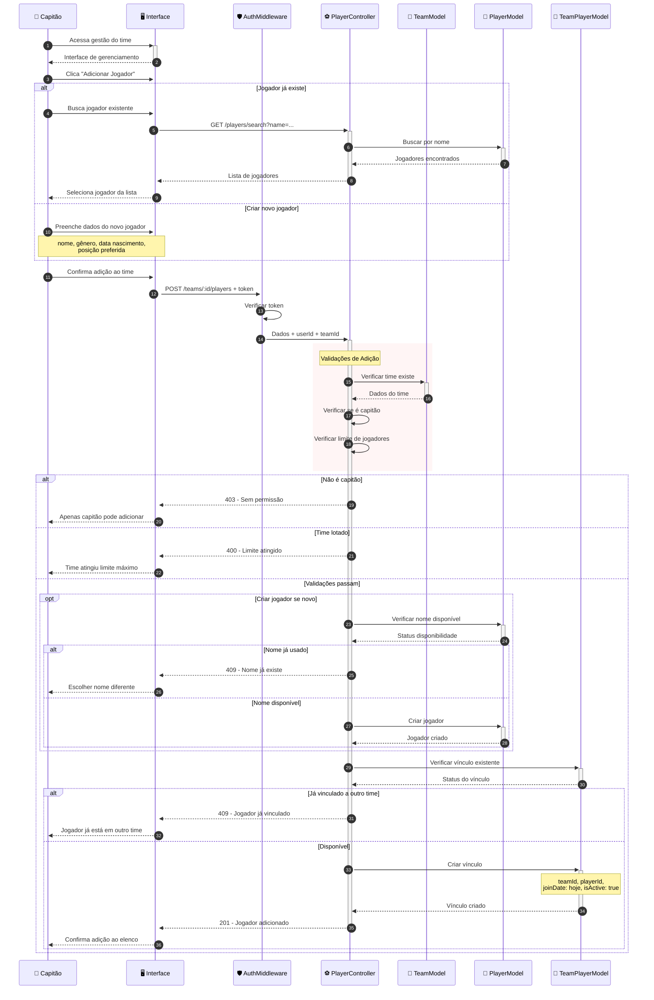
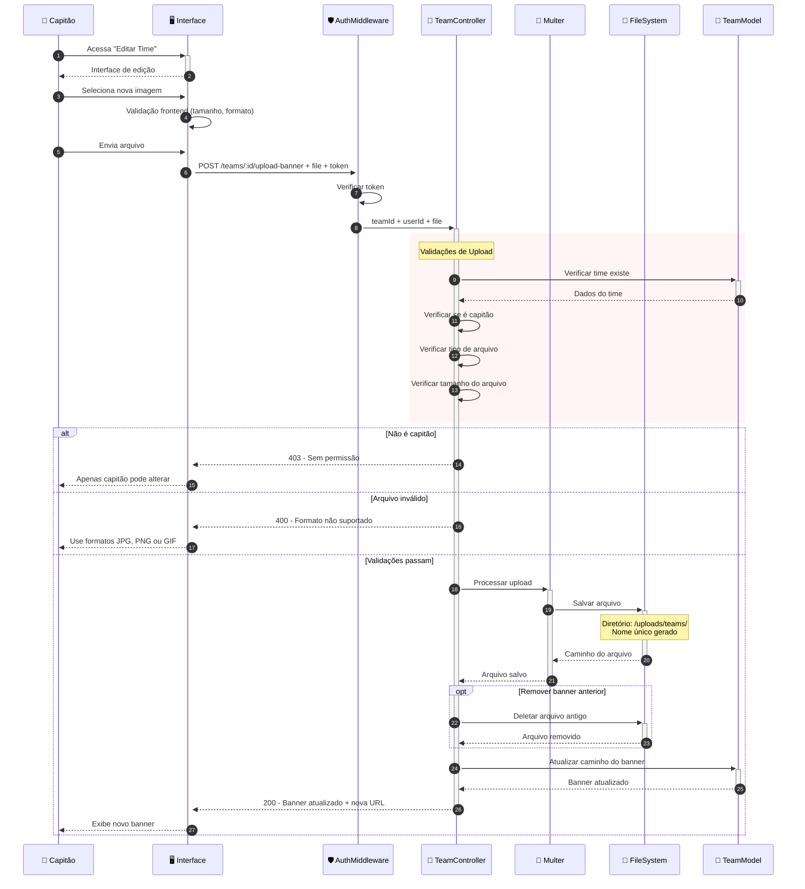

# Diagrama de Sequência - Gestão de Times e Jogadores

Este diagrama mostra o fluxo completo de criação e gestão de times, incluindo adição e remoção de jogadores no sistema VarzeaLeague.

## 👥 Fluxo de Criação de Time

```mermaid
sequenceDiagram
    autonumber
    participant User as 👤 Usuário
    participant UI as 🖥️ Interface
    participant AuthMiddleware as 🛡️ AuthMiddleware
    participant TeamController as 🏢 TeamController
    parameter UserModel as 👥 UserModel
    participant TeamModel as 🏢 TeamModel

    User->>+UI: Acessa "Criar Time"
    UI-->>-User: Exibe formulário

    User->>+UI: Preenche dados do time
    Note over User,UI: nome, descrição,<br/>cores, banner

    User->>+UI: Submete formulário
    UI->>UI: Validações frontend
    
    UI->>+AuthMiddleware: POST /teams + Bearer token
    
    AuthMiddleware->>AuthMiddleware: Verificar token JWT
    AuthMiddleware->>+TeamController: Dados + userId
    
    rect rgb(240, 248, 255)
        Note over TeamController: Validações do Backend
        TeamController->>TeamController: Verificar campos obrigatórios
        TeamController->>TeamController: Validar formato de cores
        TeamController->>TeamController: Validar tamanho da descrição
    end

    alt Validações falham
        TeamController-->>UI: 400 - Dados inválidos
        UI-->>User: Exibe erros específicos
    else Validações passam
        TeamController->>+UserModel: Verificar usuário existe
        UserModel-->>-TeamController: Dados do usuário
        
        TeamController->>+TeamModel: Verificar nome único
        TeamModel-->>-TeamController: Resultado da consulta
        
        alt Nome já existe
            TeamController-->>UI: 409 - Nome já existe
            UI-->>User: Sugerir nome diferente
        else Nome único
            TeamController->>+TeamModel: Criar time
            Note over TeamModel: userId como capitão,<br/>isDeleted: false
            TeamModel-->>-TeamController: Time criado
            
            TeamController-->>-UI: 201 - Time criado com sucesso
            UI-->>User: Confirma criação + redireciona
        end
    end
```

## ⚽ Fluxo de Adição de Jogador ao Time



## 🔄 Fluxo de Transferência de Jogador

```mermaid
sequenceDiagram
    autonumber
    participant OldCaptain as 👑 Capitão Antigo
    participant NewCaptain as 👑 Capitão Novo
    participant UI as 🖥️ Interface
    participant AuthMiddleware as 🛡️ AuthMiddleware
    participant PlayerController as ⚽ PlayerController
    parameter TeamPlayerModel as 🔗 TeamPlayerModel
    participant PlayerModel as 🏃 PlayerModel

    OldCaptain->>+UI: Acessa "Remover Jogador"
    UI-->>-OldCaptain: Lista de jogadores do time

    OldCaptain->>+UI: Seleciona jogador para remover
    UI->>+AuthMiddleware: DELETE /teams/:teamId/players/:playerId + token
    
    AuthMiddleware->>+PlayerController: teamId + playerId + userId
    
    rect rgb(255, 245, 245)
        Note over PlayerController: Validações de Remoção
        PlayerController->>PlayerController: Verificar permissão de capitão
        PlayerController->>+TeamPlayerModel: Verificar vínculo ativo
        TeamPlayerModel-->>-PlayerController: Status do vínculo
    end

    alt Não é capitão
        PlayerController-->>UI: 403 - Sem permissão
        UI-->>OldCaptain: Apenas capitão pode remover
    else Jogador não vinculado
        PlayerController-->>UI: 404 - Vínculo não encontrado
        UI-->>OldCaptain: Jogador não está no time
    else Validações passam
        PlayerController->>+TeamPlayerModel: Desativar vínculo
        Note over TeamPlayerModel: isActive: false,<br/>leaveDate: hoje
        TeamPlayerModel-->>-PlayerController: Vínculo desativado
        
        PlayerController-->>-UI: 200 - Jogador removido
        UI-->>OldCaptain: Confirma remoção
    end

    Note over NewCaptain: Agora jogador está disponível

    NewCaptain->>+UI: Busca jogadores disponíveis
    UI->>+PlayerController: GET /players/available
    PlayerController->>+PlayerModel: Buscar jogadores sem vínculo ativo
    PlayerModel-->>-PlayerController: Jogadores disponíveis
    PlayerController-->>-UI: Lista filtrada
    UI-->>-NewCaptain: Jogadores para adicionar

    NewCaptain->>+UI: Adiciona jogador disponível
    Note over NewCaptain,PlayerController: Fluxo normal de adição<br/>(reutilizando jogador existente)
```

## 🏆 Fluxo de Upload de Banner do Time



## 🎯 **Principais Funcionalidades da Gestão de Times:**

### 🏢 **Criação e Gestão de Times:**
- **Validação de nomes únicos** no sistema
- **Configuração visual** (cores primária/secundária, banner)
- **Controle de capitania** (apenas criador é capitão)
- **Soft delete** para preservar histórico

### ⚽ **Gestão de Elencos:**
- **Reutilização inteligente** de jogadores existentes
- **Sistema de vínculos ativos/inativos** para transferências
- **Controle de limites** de jogadores por time
- **Histórico completo** de participações

### 🔄 **Sistema de Transferências:**
- **Disponibilidade automática** após remoção
- **Prevenção de vínculos duplos** simultâneos
- **Rastreamento temporal** com datas de entrada/saída
- **Busca eficiente** de jogadores disponíveis

### 📁 **Gestão de Arquivos:**
- **Upload seguro** com validações de tipo/tamanho
- **Remoção automática** de arquivos antigos
- **Organização estruturada** no sistema de arquivos
- **URLs públicas** para exibição de banners